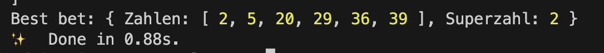

# LOTTO AI

> A fun project to predict the next german lottery numbers using an Attention LSTM neural network trained on the last 1000+ draws aka: A fancy random number generator ;)

This project develops a deep learning-based system for predicting Lotto numbers using TensorFlow.js. The primary goal of this system is to learn patterns from historical Lotto data and provide likely predictions for future draws.

## Scripts

`yarn install`: Installs the dependencies
`yarn transform`: Transforms `./data/lotto.csv` into `./data/lotto.json` for training. Add latest lottery draw values to `lotto.csv` before training.
`yarn train`: Training of the model
`yarn predict`: Prediction of lotto numbers

#### Key Components:

- **Data Preprocessing**: 
  - The `prepareData` function processes the historical data loaded from a JSON file, transforming the Lotto numbers and the “Superzahl” into a one-hot encoded format. 
  - It constructs sequences of input windows, each containing five consecutive Lotto draws, and associates each input window with the subsequent draw. 
  - The function checks for mismatches in the input and output sequence lengths, and exits the process if an error is detected.

- **Model Architecture**: 
  - The `buildALSTMModel` function defines the architecture of the predictive model, which is a form of Long Short-Term Memory (LSTM) network with attention mechanisms. 
  - This network takes sequences of one-hot encoded Lotto numbers and Superzahlen as input and outputs a sequence of predicted probabilities for the next Lotto draw.

- **Training Process**: 
  - The `train` function is responsible for the complete pipeline, from data preprocessing to model training and saving.
  - The model is trained using binary cross-entropy loss and an Adam optimizer. A dropout layer and L2 regularization are used to mitigate overfitting.
  - Training data is split, with 80% used for training and the remaining 20% for validation.

- **Prediction & Decoding**: 
  - After training, the model is used to make predictions on the validation data.
  - The `decodeBestBet` function decodes these predictions to produce a readable set of Lotto numbers and a Superzahl. 
  - The `decodePredictionsTemp` function provides an alternative decoding method that allows for control over the "temperature" of the output, making predictions more or less conservative.

- **Data Loading and Parsing**: 
  - The `loadData` function asynchronously loads Lotto data from a JSON file using the Node.js `fs` (File System) module. This data is used to train and validate the model.

- **Utility Functions**: 
  - The helper functions `hasDuplicates` and `removeDuplicateZahlen` are used to ensure the uniqueness of the predicted Lotto numbers.

- **Model Saving**: 
  - After training, the model is saved to the local file system for future use without the need for retraining.

This system represents a novel application of deep learning to the problem of predicting lottery numbers, using a unique combination of LSTMs and attention mechanisms to learn potentially useful patterns from historical data. 

*While the effectiveness of this approach for actually winning the lottery remains uncertain due to the inherently random nature of Lotto draws, this project serves as an interesting exploration of how deep learning can be applied to unconventional problems.*

## What ChatGPT / GPT-4 tells us about this approach

Although this project is a fun and interesting machine learning exercise, it's important to note that the lottery is designed to be a random game. It is extremely unlikely that even a sophisticated model like this will be able to reliably predict future lottery numbers.

Ensure that the project is used responsibly and the predictions are not used for actual betting, as this could lead to financial loss.

### Financial Loss:

*Losing Money*: Playing the lottery, especially with frequent or large bets, can be expensive over time. There is no guarantee of winning, and the vast majority of players lose money.

*Addiction*: Some people can become addicted to the act of gambling, including playing the lottery. This addiction can lead to significant financial problems as people may continually spend money they can't afford to lose.

*False Hope*: Using a machine learning model to "predict" lottery numbers might give a person unwarranted confidence that they have a higher chance of winning, leading them to spend more money on tickets than they otherwise would.

### The Odds:
*Extremely Low Probability of Winning*: The odds of winning a typical big jackpot lottery are extremely low. For example, in a typical 6/49 lottery, where a player must choose 6 numbers out of a possible 49, the odds of winning the jackpot are 1 in 13,983,816. Even with smaller prizes, the odds are still heavily against the player.

*Not a Sound Investment*: Given the extremely low odds of winning, spending money on lottery tickets is generally considered a poor investment compared to other forms of saving or investing.